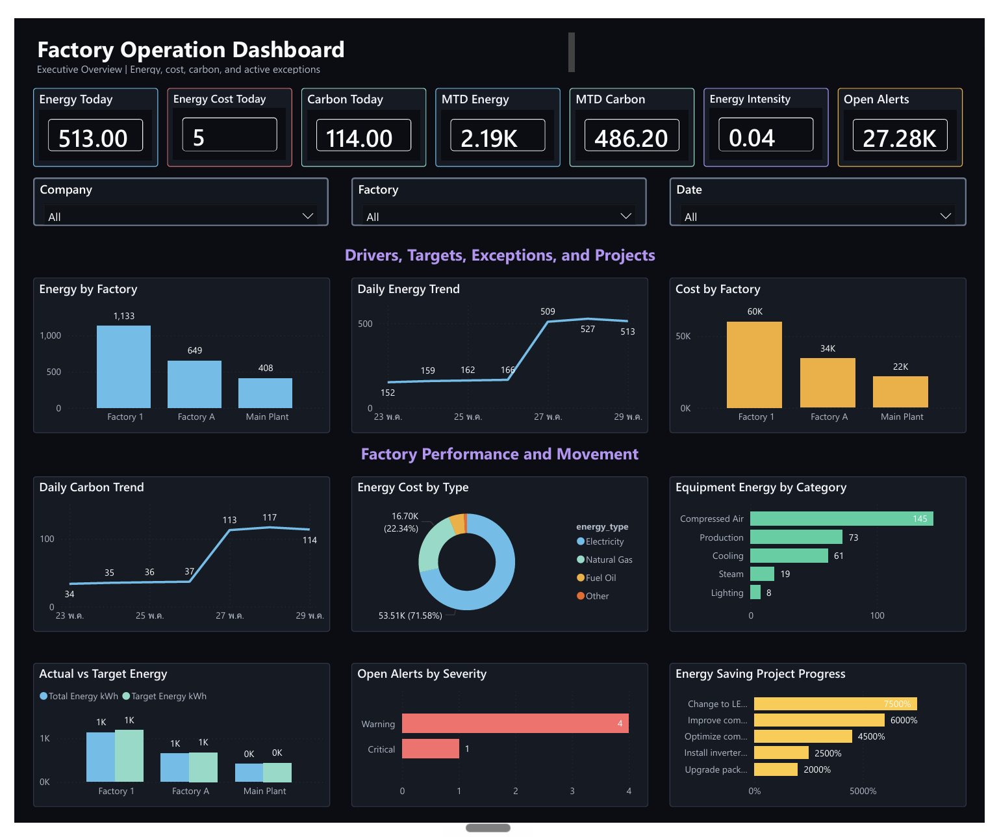

# Factory Operation Dashboard Progress Log

Last updated: 2026-06-10

## Start Here For New Sessions

Read this file first. It is the single project handoff log.

Then read only these root project docs when more context is needed:

- `Analytics_SaaS_Architecture_Decisions.md`
- `README_bigquery_setup.md`
- `README_energy_sustainability.md`

Do not create additional progress, page-guide, or PBIP-workflow markdown files for this project. Add future updates as new sections in this root progress log, even if the file becomes long.

## Current Status Snapshot

The BigQuery warehouse and the first Power BI PBIP dashboard build are in place.

Completed:

- BigQuery raw, mart, and security datasets exist.
- Power BI is connected to the BigQuery mart/security tables in Import Mode.
- PBIP project exists and is the active development format.
- Semantic model has been cleaned enough to build visuals by code.
- Dark theme and page styling are applied.
- Page 1, `Executive Overview`, is built.
- Page 2, `Energy Performance Deep Dive`, is built.
- Page 3, `Equipment and Cost Breakdown`, is built.
- Page 4, `Alerts and Energy Projects`, is built.
- Page 5, `RLS and Admin Validation`, is built.
- Page 6, `Energy Story Lab`, is built as an alternate storytelling page.
- KPI card readability was improved across Pages 1-3.

Current known issue:

- Power BI Desktop still shows `One or more calculated objects need to be manually refreshed.`
- Likely cause: the calculated DAX `Dim Date` table needs manual Desktop refresh/materialization after PBIP code edits.
- BigQuery `dim_date` mart SQL has been added, but the active Power BI `Dim Date` table remains a local calculated table for now because PBIP does not allow changing an existing partition type from `Calculated` to `M` in place.

Immediate next best step:

1. Click `Refresh now` in Power BI Desktop and save when the calculated-object banner appears.
2. Inspect Pages 1-4 and Page 6 with editing panes collapsed.
3. Inspect Pages 1-6 with editing panes collapsed.
4. Test RLS with sample users.

## Project Goal

Build a reusable multi-company Power BI dashboard backed by BigQuery mart tables, with company-level row-level security and a PBIP project structure that can be edited by code.

The first dashboard pillar is:

- Sustainability / Energy & Environment

## Current Architecture

- BigQuery project: `retail-bigquery-project-webapp`
- Location: `asia-southeast1`
- Mart dataset: `factory_dashboard_mart`
- Security table: `factory_dashboard_security.user_company_security`
- Power BI mode: Import Mode
- Power BI file format: PBIP project

Power BI project files:

- `powerbi/Factory_Operation_Dashboard_MVP.pbip`
- `powerbi/Factory_Operation_Dashboard_MVP.Report`
- `powerbi/Factory_Operation_Dashboard_MVP.SemanticModel`
- `powerbi/Factory_Operation_Dashboard_MVP.pbix` as the older PBIX backup/source file

Theme files:

- `powerbi/Factory_Operation_Dashboard_Theme.json`
- `powerbi/Factory_Operation_Dashboard_MVP.Report/StaticResources/RegisteredResources/Factory_Operation_Dashboard_Da935288659519418.json`

## Imported Power BI Tables

Imported from `factory_dashboard_mart`:

- `dim_company`
- `dim_factory`
- `dim_equipment`
- `dim_date` exists in the mart SQL as the intended future source for a date dimension
- `mart_energy_alerts`
- `mart_energy_cost_by_type`
- `mart_energy_daily`
- `mart_energy_equipment_daily`
- `mart_energy_hourly`
- `mart_energy_projects`
- `mart_energy_targets`

Imported from `factory_dashboard_security`:

- `user_company_security`

## Semantic Model Status

Completed:

- Created/cleaned relationships on company, factory, equipment, and date keys.
- Removed Power BI auto date table artifacts from the active PBIP model.
- Removed duplicate `user_company_security (2)` references.
- Disabled model auto time intelligence metadata.
- Created a reusable `Dim Date` calculated table spanning fact/project date fields.
- Reworked MTD measures away from `TOTALMTD` to latest-data-date logic so mock-data cards render correctly.
- Kept `powerbi/Factory_Operation_Dashboard_Measures.dax` aligned with the active model.

Important validation searches returned no active references to:

- `LocalDateTable`
- `DateTableTemplate`
- `user_company_security (2)`
- `defaultHierarchy`
- `variation Variation`
- `TOTALMTD`

## Relationship Design

Core dimension-to-fact relationship approach:

- `dim_company[company_id]` filters fact/security tables by `company_id`.
- `dim_factory[factory_id]` filters factory-grain fact tables by `factory_id`.
- `dim_equipment[equipment_id]` filters equipment/alert facts by `equipment_id`.
- `'Dim Date'[Date]` filters dated fact tables by `date`.

RLS target flow:

- `user_company_security`
- `dim_company`
- fact tables

RLS role:

- `CompanyAccess`

RLS filter pattern:

```dax
[user_email] = USERPRINCIPALNAME()
```

Sample users to test:

- `viewer.company1@example.com`
- `viewer.company2@example.com`
- `viewer.company3@example.com`
- `admin@example.com`

Expected RLS behavior:

- each company viewer sees only the matching company
- `admin@example.com` only sees rows explicitly mapped in `user_company_security`
- for all-company admin access, add one admin row per company

## PBIP Code Workflow

The dashboard is now saved as a Power BI Project and can be edited from the repo.

Editable by code:

- Semantic model tables, measures, relationships, roles:
  - `powerbi/Factory_Operation_Dashboard_MVP.SemanticModel/definition/**/*.tmdl`
- Report structure, pages, and visuals:
  - `powerbi/Factory_Operation_Dashboard_MVP.Report/definition/**/*.json`
- Theme:
  - `powerbi/Factory_Operation_Dashboard_Theme.json`

Important PBIP workflow lessons:

- Stop Power BI Desktop before code-editing PBIP visual JSON, or Desktop may save its in-memory state over the file edits.
- Use Power BI Desktop only after code edits to validate rendering and save the accepted PBIP state.
- Avoid Windows PowerShell `Set-Content -Encoding UTF8` for PBIP JSON because it can write UTF-8 BOM in Windows PowerShell.
- Prefer UTF-8 without BOM for active PBIP JSON files.
- Validate JSON after code edits.

Useful validation checks:

```powershell
Get-ChildItem -LiteralPath 'powerbi\Factory_Operation_Dashboard_MVP.Report','powerbi\Factory_Operation_Dashboard_MVP.SemanticModel' -Recurse -Filter *.json |
  ForEach-Object {
    $text = [System.IO.File]::ReadAllText($_.FullName)
    $null = $text | ConvertFrom-Json
  }
```

```powershell
rg -n "LocalDateTable|DateTableTemplate|user_company_security \(2\)|defaultHierarchy|variation Variation|TOTALMTD" powerbi
```

## Theme Status

Completed:

- Created a dark Power BI theme JSON.
- Updated page background and outspace styling to reduce white space and eye strain.
- Applied dark visual containers, borders, text colors, and chart colors through PBIP visual JSON.

Dark styling intent:

- dark page canvas
- dark outspace
- dark slicers/filter-like controls
- high contrast white/light gray text
- several coordinated accent colors instead of one flat palette

KPI card cleanup completed:

- hid redundant repeated card labels under the callout values
- shortened card titles so they fit in the available width
- increased/standardized callout value readability
- changed equipment/cost share measures from two-decimal percentages to whole percentages for cleaner cards

## Built Pages

### Page 1 - Executive Overview

Status: built and validated in Power BI Desktop.

PBIP page folder:

- `powerbi/Factory_Operation_Dashboard_MVP.Report/definition/pages/a78190c82eebee7aca73`

Purpose:

- answer whether energy performance is healthy right now

Implemented:

- 7 KPI cards
- 3 global slicers
- factory performance charts
- daily energy and carbon trends
- cost mix
- equipment energy
- actual vs target
- alert severity
- project progress

KPI cards:

- `Energy Today kWh`
- `Energy Cost Today THB`
- `Carbon Today kgCO2e`
- `MTD Energy kWh`
- `MTD Carbon kgCO2e`
- `Energy Intensity kWh per Unit`
- `Open Alert Count`

Slicers:

- `dim_company[company_name]`
- `dim_factory[factory_name]`
- `'Dim Date'[Date]`

Charts:

- `Energy by Factory`
- `Daily Energy Trend`
- `Cost by Factory`
- `Daily Carbon Trend`
- `Energy Cost by Type`
- `Equipment Energy by Category`
- `Actual vs Target Energy`
- `Open Alerts by Severity`
- `Energy Saving Project Progress`

### Page 2 - Energy Performance Deep Dive

Status: built and validated in Power BI Desktop.

PBIP page folder:

- `powerbi/Factory_Operation_Dashboard_MVP.Report/definition/pages/3fe6bf7f98cb3abbc806`

Purpose:

- explain why executive energy KPIs are moving

Implemented:

- 7 KPI cards
- 3 global slicers
- hourly actual vs forecast
- daily actual vs target
- energy variance by factory
- cost per kWh by factory
- energy cost by type
- equipment energy by category
- energy intensity by factory
- equipment share by criticality

KPI cards:

- `Total Energy kWh`
- `Target Energy kWh`
- `Energy Variance %`
- `Cost per kWh THB`
- `Hourly Energy kWh`
- `Hourly Forecast kWh`
- `Hourly Forecast Variance %`

Slicers:

- `dim_company[company_name]`
- `dim_factory[factory_name]`
- `'Dim Date'[Date]`

Charts:

- `Energy Variance by Factory`
- `Hourly Actual vs Forecast`
- `Cost per kWh by Factory`
- `Daily Actual vs Target Energy`
- `Energy Cost by Type`
- `Equipment Energy by Category`
- `Actual vs Target Energy by Factory`
- `Energy Intensity by Factory`
- `Equipment Share by Criticality`

### Page 3 - Equipment and Cost Breakdown

Status: built and validated in Power BI Desktop.

PBIP page folder:

- `powerbi/Factory_Operation_Dashboard_MVP.Report/definition/pages/5a5c34a879659342c34b`

Purpose:

- show what equipment and energy-type mix are driving energy use, spend, and operational risk

Implemented:

- 7 KPI cards
- 3 global slicers
- equipment energy by category
- energy by equipment criticality
- equipment energy by factory
- daily equipment energy trend
- energy cost by type
- equipment energy by status
- cost per kWh by factory
- energy share by equipment category
- open alerts by equipment category

KPI cards:

- `Equipment Energy kWh`
- `Equipment Energy Share %`
- `Energy Type Cost THB`
- `Energy Type Cost Share %`
- `Cost per kWh THB`
- `Energy Intensity`
- `Open Alert Count`

Slicers:

- `dim_company[company_name]`
- `dim_factory[factory_name]`
- `'Dim Date'[Date]`

Charts:

- `Equipment Energy by Category`
- `Energy by Equipment Criticality`
- `Equipment Energy by Factory`
- `Daily Equipment Energy Trend`
- `Energy Cost by Type`
- `Equipment Energy by Status`
- `Cost per kWh by Factory`
- `Energy Share by Equipment Category`
- `Open Alerts by Equipment Category`

## Remaining Page Story

The planned dashboard has five main report pages for now.

### Page 4 - Alerts and Energy Projects

Purpose:

- turn monitoring into action

Recommended visuals:

- card: open alert count
- card: critical alert count
- table: latest alerts
- bar chart: alerts by severity
- table: project progress
- card: expected annual saving
- bar chart: projects by status

Build status:

- Built as `Alerts and Energy Projects`
- Page ID: `28caeabe1233c201b300`
- Canvas: `1280 x 1060`
- Visual count: 18

Built visuals:

- KPI cards: Open Alerts, Critical Alerts, Warning Alerts, Active Projects, Avg Progress, Expected Saving
- Slicers: Company, Factory, Date
- Section: Alert Triage
- Bar chart: Open Alerts by Severity
- Bar chart: Open Alerts by Type
- Bar chart: Open Alerts by Equipment Category
- Section: Project Execution
- Bar chart: Project Progress by Initiative
- Column chart: Projects by Status
- Bar chart: Expected Saving by Initiative

Implementation note:

- The original plan included tables for latest alerts and project progress.
- Because no stable table visual template exists in the PBIP yet, Page 4 was built quickly with chart-led native visuals using proven chart/card JSON patterns.
- Add tables later only if needed after the main dashboard pages are complete.

### Page 5 - RLS and Admin Validation

Purpose:

- verify security and data visibility before publishing

Recommended visuals:

- card: current visible company count
- table: visible companies
- table: visible factories
- table: visible users from `user_company_security`
- card: row count in `mart_energy_daily`
- card: row count in `mart_energy_alerts`

Hide this page before customer release if desired.

Build status:

- Built as `RLS and Admin Validation`
- Page ID: `93d7097f65b20698ca85`
- Canvas: `1280 x 1060`
- Visual count: 20
- Layout style: alternate storytelling style, similar to `Energy Story Lab`

Built visuals:

- KPI rail: Visible Companies, Visible Factories, Security Users, Active Assignments, Energy Rows, Alert Rows
- Slicers: Company, Factory, Date
- Section: Security scope and visibility
- Hero bar chart: Security Assignments by Role
- Supporting chart: Factory Visibility by Company
- Section: Data coverage checks
- Supporting charts: Security Users by Company, Energy Rows by Company, Alert Rows by Severity
- Bottom checks: Project Rows by Status, Assignments by Company, Factories by Province

Implementation note:

- Page 5 intentionally uses the Page 6 storytelling style rather than the standard grid pattern.
- This creates a six-page report where Pages 1-4 use consistent operational grids, while Pages 5-6 use alternate narrative layouts to avoid repetition.
- Table visuals remain deferred because the current PBIP has no stable table visual template yet.

## Validation Completed

Repeated checks after PBIP code edits and Power BI Desktop saves:

- PBIP JSON parses successfully.
- Active PBIP JSON has no UTF-8 BOM issue.
- Page 1 has 22 visual containers.
- Page 2 has 22 visual containers.
- Page 3 has 22 visual containers.
- Page 4 has 18 visual containers.
- Page 5 has 20 visual containers.
- Power BI Desktop fresh-loaded Page 1 successfully.
- Power BI Desktop fresh-loaded Page 2 successfully.
- Power BI Desktop fresh-loaded Page 3 successfully.
- Power BI Desktop saved the project after Page 2 rendered.
- Power BI Desktop saved the project after Page 3 rendered.
- Power BI Desktop saved the project after KPI card readability fixes rendered.

## Current Known Issues

- Power BI Desktop still shows the calculated-object refresh banner.
- The true consumer reading experience is best checked in Power BI Service after publishing.
- Desktop editing panes should be collapsed for visual inspection.
- Some final visual polish may still be needed after manual inspection at 100% or Fit to page.

## Suggested Next Steps

1. Click `Refresh now` in Power BI Desktop and save.
2. Inspect Page 1 and Page 2 with editing panes collapsed.
3. Test RLS with sample users:
   - `viewer.company1@example.com`
   - `viewer.company2@example.com`
   - `viewer.company3@example.com`
4. Build Page 4.
5. Keep the current calculated `Dim Date` table for now so the PBIP opens cleanly.
6. Publish to Power BI Service for true reading-view validation.

## Documentation Rule

Keep markdown documentation simple:

- root markdown files only
- no progress logs inside subfolders
- no separate page guide markdown files
- no separate PBIP workflow markdown file
- append updates to this progress log instead of creating new markdown files

Current intended markdown set:

- `Factory_Operation_Dashboard_Progress_Log.md`
- `Analytics_SaaS_Architecture_Decisions.md`
- `README_bigquery_setup.md`
- `README_energy_sustainability.md`

## Lessons Learned For Future Dashboard Projects

These lessons should guide future Power BI/dashboard projects, even when the business domain changes, such as HR, workforce management, operations, finance, or another dashboard area.

### Avoid Documentation Fragmentation

Mistake made:

- too many small markdown files were created across root and subfolders
- page-specific and workflow notes became scattered
- this made the project harder to trace and harder to resume in a new session

Future rule:

- keep one root progress/handoff log
- append new sections to the existing log instead of creating new markdown files
- keep only a few root-level markdown files with clear jobs
- avoid markdown files inside feature/tool subfolders unless the user explicitly asks for them

### KPI Card Readability Comes First

Mistake made:

- KPI cards showed both a title and a repeated category label under the value
- the repeated bottom label was clipped and hard to read
- some card titles were too long for the available width
- percentage values were over-formatted and visually noisy

Future rule:

- KPI cards should have one clear title and one readable value
- hide redundant category labels when the title already explains the metric
- use short card titles
- choose value precision for readability, not maximum detail
- test cards at the actual report zoom/viewport, not only by inspecting JSON

### Theme And Alignment Standard

User preference:

- dark dashboard theme to reduce eye strain
- high contrast text
- clean card alignment
- consistent visual spacing
- professional operating-dashboard feel
- no cluttered or overly decorative dashboard styling

Future rule:

- reuse this dark, aligned, operational style as the baseline for future dashboards
- adapt the metrics and visuals to the business domain, but keep the same discipline around layout, contrast, spacing, and readable KPI cards
- for HR/workforce dashboards or other domains, do not copy the energy metrics, but do carry over the visual quality standard

### PBIP Editing Workflow

Mistake/risk observed:

- Power BI Desktop can overwrite code-edited PBIP JSON with its in-memory state
- generated visuals can silently fail or render blank if the visual JSON shape is too ambitious

Future rule:

- stop Power BI Desktop before code-editing PBIP files
- reuse known-good visual JSON patterns before inventing new structures
- run a light JSON validation check
- open Desktop once to verify rendering
- save only after visuals are visibly accepted

## 2026-06-10 - Alternate Page 2 Experiment With KPI Icons

Built an experimental alternate Page 2 in the PBIP project:

- Page ID: `bba489ecb609611ebc31`
- Page name: `Energy Story Lab`
- Purpose: test a less repetitive storytelling layout before continuing Page 4
- Story: load shape first, then cost mix, then action concentration by factory/equipment/criticality

What changed:

- Rebuilt previously empty Page 6 as `Energy Story Lab`
- Kept the original `Energy Performance Deep Dive` page intact
- Added a left-side KPI rail with scorecard-only icon overlays
- Used a larger hero chart for hourly actual vs forecast
- Used smaller diagnostic panels for cost mix, variance, equipment category load, cost per kWh, actual vs target, intensity, and criticality share
- Set the new page as the active page in `pages.json`

Icon handling:

- Downloaded free Lucide SVG source icons into root folder `assets/icons/lucide`
- Chosen icons are business-matched: energy, variance/activity, cost, intensity/forecast gap, and alerts
- Power BI image visuals showed placeholders with raw SVG resources, so PBIP registered resources now use small PNG render copies generated from the Lucide SVGs
- Root SVG files remain the source assets; PBIP PNG files are just render copies for compatibility

Validation:

- All PBIP report JSON files parse successfully
- Power BI Desktop loaded the new page layout successfully with the area hero chart and resized panels
- Initial SVG image visual load showed placeholder boxes; PNG resource registration was applied afterward

Future rule:

- For Power BI scorecard icons, keep SVG sources in the project root for traceability, but register PNG copies in PBIP when using the native Image visual
- Use icons only when they clarify KPI meaning; do not decorate every chart
- When pages start feeling repetitive, change the visual hierarchy and reading path, not just chart colors

Follow-up correction:

- The image icon layer still rendered as broken placeholder icons in Power BI Desktop
- Removed the scorecard image visuals from `Energy Story Lab` for now
- Kept the downloaded Lucide SVG source files in root `assets/icons/lucide`
- Removed temporary PBIP icon registrations so the report no longer carries broken image resources
- Shortened the page header to `Energy Story Lab`
- Moved and restyled the top slicers for better contrast and readability
- Nudged the page charts down to create clearer separation from the header/filter strip

Future rule:

- In experiment mode, do a light structural check and one visible design pass only
- If an icon/image binding is not immediately clean, remove it and keep the dashboard readable
- Do not spend long verification cycles on decorative additions before the layout and text are readable

### Design Lesson - Use Alternative Page Styles To Avoid Repetition

The `Energy Story Lab` page is a useful pattern for future dashboards because it breaks the repeated card-grid rhythm used on the earlier pages.

The normal grid pattern is not bad. It is useful for executive summaries and pages where the reader needs fast comparison across many KPIs and charts. The risk is that if every page uses the same structure, the report can feel repetitive and less engaging.

Future rule:

- Mix page styles across a multi-page dashboard
- Use the standard KPI-and-chart grid when the page needs broad scanability
- Use an alternate storytelling layout when the page needs stronger narrative flow
- A good alternate layout can use a KPI rail, one large hero chart, and smaller supporting diagnostic charts
- Keep the same theme, spacing discipline, and readability rules even when the layout changes
- Avoid changing style just for decoration; the style change should help the reader understand the story faster

Reusable page-style examples:

- Executive grid: KPI strip on top, slicers under/near title, balanced chart grid below
- Diagnostic grid: KPI strip plus repeated factory/equipment/cost breakdown panels
- Story lab: vertical KPI rail, large hero chart, compact supporting panels, clearer reading path from main pattern to action focus

## 2026-06-10 - Slicer And Section Divider Readability Pass

Updated the built report pages to make the slicer/filter area cleaner and the section dividers more visible.

Pages touched:

- `Executive Overview`
- `Energy Performance Deep Dive`
- `Equipment and Cost Breakdown`
- `Energy Story Lab`

What changed:

- Slicer titles now show only the friendly labels: `Company`, `Factory`, and `Date`
- Suppressed duplicate technical field names such as `company_name`, `factory_name`, and `Date` inside the slicer body/header area
- Reduced slicer height so the filter strip consumes less page space
- Increased slicer border contrast so each filter box is still visible on the dark theme
- Moved section labels/dividers down enough to be visible between the slicers and chart blocks
- Applied the changes consistently across all currently built pages

Lesson learned:

- Slicers should show friendly business labels only; do not expose technical column names to report users
- A dark theme needs slightly stronger borders and spacing around filter controls, otherwise sections blend together
- Section labels are useful only when they have enough vertical breathing room; do not squeeze them directly under slicers
- When one layout issue appears on multiple pages, fix it through a consistent PBIP pattern rather than manually tweaking a single page

## 2026-06-10 - Data Labels Applied To Line And Bar Charts

Updated all currently built report pages so line, area, column, and bar charts show data labels.

Pages touched:

- `Executive Overview`
- `Energy Performance Deep Dive`
- `Equipment and Cost Breakdown`
- `Energy Story Lab`

Visual types updated:

- `lineChart`
- `areaChart`
- `clusteredColumnChart`
- `clusteredBarChart`

Formatting applied:

- Data labels turned on
- Label color set to light text for the dark theme
- Label font size set to `9`
- Decimal places set to `0`
- Bar and column labels positioned outside end where supported

Lesson learned:

- For operational dashboards, line and bar charts should show data labels by default unless labels create obvious clutter
- Dark-theme labels need high contrast and conservative font size
- Apply label rules consistently across pages so users do not have to relearn the visual language page by page

## 2026-06-10 - Text Hierarchy And Header Weight Rule

Updated all currently built pages so the page title/header uses bold text.

Pages touched:

- `Executive Overview`
- `Energy Performance Deep Dive`
- `Equipment and Cost Breakdown`
- `Energy Story Lab`

Lesson learned:

- Treat the page title as the dashboard H1
- Treat major section labels as H2/H3-style headings
- Page titles and section headers should use clear visual hierarchy: larger size, bold weight, high contrast
- Do not let section labels appear stronger than the page title
- Apply typography hierarchy consistently across all pages, not only the page currently being edited

## 2026-06-10 - Canvas Height Increased To 1060

Updated the built report pages from `1280 x 960` to `1280 x 1060`.

Pages touched:

- `Executive Overview`
- `Energy Performance Deep Dive`
- `Equipment and Cost Breakdown`
- `Energy Story Lab`

What changed:

- Page canvas height increased to `1060`
- Chart rows were redistributed vertically rather than simply stretching the page
- Standard grid pages now use more height for each chart row and clearer spacing between section headings and visuals
- `Energy Story Lab` now gives the hero load-shape band more vertical space and separates the action-focus section more clearly

Lesson learned:

- Dense operational dashboards need enough canvas height for chart labels, legends, and section hierarchy to breathe
- Increasing page height should include repositioning visuals, not only changing the canvas setting
- For this project style, `1280 x 1060` is a better baseline than `1280 x 960` when using KPI cards, slicers, section headers, and three rows of charts

## 2026-06-10 - Default Active Page Must Return To Page 1

Issue:

- During editing, the PBIP `activePageName` was temporarily set to `Energy Story Lab` / Page 6 for inspection
- When Power BI Desktop reopened, it kept opening on Page 6 instead of Page 1

Current fix:

- `pages.json` active page was reset to Page 1 / `Executive Overview`
- Page 1 ID: `a78190c82eebee7aca73`

Future rule:

- It is okay to temporarily set `activePageName` to the page being edited
- Before handoff or final save, always reset `activePageName` to Page 1
- Default open page should be `Executive Overview`
- This must be checked after any PBIP page editing work, especially when editing Page 2, Page 3, Page 6, or future pages

## 2026-06-10 - Page 4 Fast Build And Deferred Model Cleanup

Page 4 was built quickly by reusing known-good PBIP card, slicer, textbox, and bar/column chart patterns.

Lesson learned:

- For fast dashboard iteration, reuse proven visual JSON structures before introducing new visual types
- If a planned table visual does not already have a stable template, use chart-led alternatives first and add tables later
- Keep design rules consistent while moving fast: bold H1 page title, H2 section labels, readable slicers, data labels, dark theme, `1280 x 1060` canvas, and active page reset to Page 1
- Do not spend time on semantic-model cleanup during page-building unless it blocks the visual work

Backend improvement attempted and rolled back in PBIP:

- Added a BigQuery mart view definition for `factory_dashboard_mart.dim_date`
- The view builds a date spine from the min/max dates across alert, cost, daily, equipment daily, hourly, project start, and project target-finish dates
- Attempted to switch the existing Power BI table named `Dim Date` from a DAX calculated table to a BigQuery import partition
- Power BI Desktop rejected the PBIP definition with: `Changing the partition type from or to PartitionType.Calculated is not allowed; partition 'Table' of table 'Dim Date'.`
- Rolled the active PBIP `Dim Date` table back to the calculated partition so the report opens cleanly
- Default active page was reset to Page 1 / `Executive Overview` after the semantic model edit

Validation:

- Report JSON parsed successfully
- The active `Dim Date` TMDL is back to `partition Table = calculated`
- Existing date relationships still point to `'Dim Date'[Date]`

Future date-dimension migration path:

- Do not mutate an existing calculated table partition into an M/import partition through PBIP
- Use Power BI Desktop to create/import a separate BigQuery `dim_date` table, then migrate relationships/measures after Desktop accepts the new table
- Or rebuild the semantic model table cleanly from the imported source in Desktop/Tabular Editor instead of changing the partition type in place
- For now, keep the calculated `Dim Date` table and continue dashboard completion

Lesson learned:

- PBIP TMDL edits are not always equivalent to supported semantic-model migrations
- Changing a partition type from `Calculated` to `M` can make the PBIP fail to open
- For structural model migrations, prefer adding a new table/source first, validating in Desktop, and only then replacing relationships/measures

### Important PBIP Lesson - Do Not Change Calculated Partition Type In Place

Issue encountered:

- We tried to replace the local DAX calculated `Dim Date` table with an imported warehouse-backed date table by editing the existing `Dim Date.tmdl`
- The edit changed the existing partition from `calculated` to `m`
- Power BI Desktop refused to open the PBIP and showed:
  - `Changing the partition type from or to PartitionType.Calculated is not allowed; partition 'Table' of table 'Dim Date'.`

Why this matters:

- This is a Power BI semantic model limitation, not a BigQuery-only issue
- The same problem can happen with any data warehouse or source connector, such as BigQuery, Fabric Warehouse, SQL Server, Snowflake, Databricks, or PostgreSQL
- A PBIP/TMDL file edit can describe a change that looks logical in code but is not accepted as an in-place semantic model migration by Power BI Desktop

What fixed it:

- Restore the original table partition type back to `calculated`
- Restore the original calculated DAX expression for the partition
- Keep the table name, lineage tags, relationships, and measures stable
- Reopen Power BI Desktop after rollback
- Keep the warehouse `dim_date` SQL/view as a prepared future source, but do not wire it into the existing calculated table by changing the partition type directly

Future safe migration pattern:

- Create/import the warehouse-backed date dimension as a new table first, for example `dim_date_import` or `Dim Date Warehouse`
- Validate that Power BI Desktop accepts and refreshes the new imported table
- Recreate or migrate date relationships from facts to the new imported date table
- Update DAX references only after the new table is stable
- Remove the old calculated date table only after visuals, relationships, measures, and refresh all work
- Save a working PBIP before and after the migration step

Decision for this project:

- Keep the current local calculated `Dim Date` table for now
- Keep the BigQuery `factory_dashboard_mart.dim_date` view definition in the repo as a future improvement
- Continue dashboard completion without spending more time on the date-table migration during the visual/report build phase

## 2026-06-10 - Page 5 Build And Single-Series Chart Color Rule

Page 5 was built as `RLS and Admin Validation` using the alternate storytelling layout established by `Energy Story Lab`.

Report page structure now:

- Pages 1-4: standard operational grid style
- Page 5: alternate admin/security storytelling style
- Page 6: alternate energy story lab style

Color update:

- Page 4 single-series bar/column charts were updated so each chart uses a distinct but coordinated dark-theme accent color
- Page 5 was built with varied chart colors from the start

Lesson learned:

- Repeating the same bar color across every single-series chart on a page looks flat and boring
- For dark dashboards, single-series charts can use different accent colors when each chart represents a different business concept
- Colors should still be coordinated: alerts can use red/orange, savings can use gold, security/admin can use purple/blue/green
- Do not use random colors; color variation should help the reader understand the page story
- It is good for a six-page report to mix layout styles: consistency for core operating pages, variation for admin/storytelling pages

## 2026-06-10 - Working Rules From User Feedback For Future Projects

This section records general lessons from the working conversation. It should guide future dashboard projects, even if the domain changes from energy operations to HR, workforce management, finance, sales, or another business area.

### Preserve Lessons From Chat

User expectation:

- Do not let useful feedback disappear after the chat ends
- Keep updating this root progress log with practical lessons learned
- Use the lessons as defaults in future projects instead of repeating the same mistakes

Future rule:

- When the user gives visual or workflow feedback, convert it into a reusable dashboard rule
- Keep lessons in the existing root progress log, not scattered markdown files
- Summarize the principle, the reason, and the future behavior

### Speed Versus Verification

Observed issue:

- Too much time was spent verifying experimental changes
- Even with extra verification, visible design issues still appeared, such as broken image icons and cramped headers

Future rule:

- In experiment mode, move faster and validate lightly
- Prefer one quick structural check, such as JSON parse, plus user visual inspection
- Do not run long verification loops for decorative or low-risk changes
- Spend careful verification on model integrity, RLS, refresh behavior, and production handoff
- For visual experiments, make a practical change quickly, then let the user inspect

### PBIP Editing And Power BI Desktop Behavior

Important behavior:

- PBIP report design changes are JSON/TMDL files on disk
- Power BI Desktop keeps report layout in memory after opening
- The Desktop `Refresh` button refreshes data/model objects, not report-layout JSON
- Code-edited layout changes usually require closing and reopening the PBIP
- The calculated-object refresh banner is different from BigQuery data refresh

Future rule:

- Tell the user clearly when a change is a PBIP file change that requires reopen
- Batch design edits where possible to reduce close/reopen cycles
- Keep `activePageName` reset to Page 1 before handoff
- Do not confuse semantic/model refresh with report-layout reload

### Power BI Screenshot / GitHub Showcase Workflow

Issue encountered:

- Too much time was wasted trying to take a Power BI dashboard screenshot through desktop/window capture automation
- The captured image only showed the visible editor area, not the full report page in view/reading mode
- The user expectation for GitHub README showcasing was full-page dashboard images, not a cropped partial canvas

Future rule:

- When the user asks for Power BI dashboard screenshots, do not spend time fighting desktop screenshot automation
- First think: `Export to PDF`
- Ask the user to export the Power BI report/page to PDF if direct export automation is not immediately available
- The user can quickly convert or extract the PDF pages into PNG images
- The user will provide the folder path containing those PNGs
- Copy those PNGs into a tracked repo path such as `assets/screenshots/dashboard-pages/`
- Add the original local screenshot folder to `.gitignore` if requested, for example `Dashboard Screenshot/`
- Embed the PNGs sequentially in `README.md`
- Commit and push only after the README uses the correct full-page images

Preferred README pattern:

```markdown
[Open the exported dashboard PDF](assets/exports/Factory_Operation_Dashboard_MVP.pdf)

## Dashboard Preview

### Page 1 - Executive Overview


```

Lesson learned:

- For Power BI portfolio/GitHub screenshots, PDF export is faster and more reliable than UI screenshot capture
- Full-page exported images communicate the dashboard better than partial desktop crops
- Avoid over-checking or over-automating simple screenshot tasks; use the user's provided exported assets directly

### Visual Hierarchy Defaults

User preference:

- Report title should act like an HTML H1
- Major section labels should act like H2/H3
- Headers must be visibly meaningful, not tiny captions hidden by charts

Future rule:

- Page title: largest, bold, high contrast
- Section header: clearly smaller than page title but still bold and prominent
- Section header color does not need to be white; use an intentional accent color when it improves the page hierarchy
- For the current dark theme, purple `#B794F4` works well for section/divider text
- Slicer labels and card titles: smaller, readable, and consistent
- Do not let chart titles or section labels visually overpower the page title
- Leave enough vertical space around section headers so the story structure is obvious

### Slicer And Filter Defaults

User preference:

- Slicers should show friendly labels only
- Do not expose technical field names like `company_name` or `factory_name`
- Filter boxes should be visible on the dark theme

Future rule:

- Slicer title should be `Company`, `Factory`, `Date`, or another business-friendly label
- Hide duplicated field headers inside slicers
- Use stronger border contrast and enough height for dark-theme slicers
- Keep slicers consistent across pages

### KPI Card Defaults

Observed issue:

- KPI cards can become unreadable when value font is too large or labels are repeated
- Bottom labels under KPI values were clipped and unnecessary

Future rule:

- KPI cards should have one clear title and one readable value
- Hide redundant category labels when the title already names the metric
- Use shorter KPI names
- Size value text to fit the actual card, not just the design ideal

### Chart Defaults

User preference:

- Line charts and bar charts should show data labels
- Single-series charts should not all reuse the exact same color on one page
- Dark theme should stay professional and business-focused, not decorative

Future rule:

- Enable data labels by default for line, area, bar, and column charts unless clutter is obvious
- Use high-contrast label color on dark backgrounds
- Use varied but coordinated accent colors when multiple single-series charts appear on one page
- Match color to meaning: alerts can be red/orange, savings gold, security/admin blue/purple/green
- Avoid random color changes that do not help the page story

### Page Style Mix

User preference:

- Repeating the exact same layout across every page can feel boring
- A report can keep one theme while mixing page structures

Future rule:

- Use standard grid pages for broad operating review
- Use alternate storytelling pages for deeper narrative, admin validation, or special analysis
- A six-page report can intentionally mix styles, for example Pages 1-4 standard grid and Pages 5-6 story-lab style
- Style variation should support the business story, not become artwork

## 2026-06-10 - Section Divider Alignment Rule

Updated all section/divider textboxes across the built pages.

Pages touched:

- `Executive Overview`
- `Energy Performance Deep Dive`
- `Equipment and Cost Breakdown`
- `Alerts and Energy Projects`
- `RLS and Admin Validation`
- `Energy Story Lab`

What changed:

- Section/divider textboxes now span the same full content width
- Section text is horizontally centered
- Section text uses the purple accent `#B794F4`
- Section text remains bold and prominent as the H2/H3 story divider
- Default active page was reset to Page 1 after the edit

Lesson learned:

- Section/divider labels must be aligned consistently across all pages
- Do not mix left-aligned and centered section headers in the same report unless there is a deliberate layout reason
- For this dashboard style, section dividers should be centered and use a distinct purple accent so they read as story breaks
- Section/divider text does not have to be white; choose a visually beautiful accent color that matches the theme and clarifies hierarchy
- Section headers should organize the page narrative, not look like accidental chart captions

## 2026-06-10 - Page 6 KPI Icon Experiment

Added and then removed a controlled KPI icon experiment on `Energy Story Lab` only.

What changed:

- Added one small icon-style marker per KPI card on the Page 6 KPI rail
- Icons are aligned to the same top-right position inside each KPI card
- Icons use accent colors matched to KPI meaning:
  - energy: blue
  - variance: orange
  - cost: gold
  - forecast gap: green
  - alerts: red

Implementation note:

- The native Power BI image visual previously rendered broken placeholders when bound through PBIP resources
- For this test, icon-style textboxes were used instead of native image visuals to preserve alignment and avoid broken image placeholders
- Treat this as a visual taste test before applying icons to other pages

Lesson learned:

- KPI icons must align precisely inside the card block and must not compete with the KPI value
- Add icons to one test page first before scaling across the full report
- If native image binding is unreliable, use a safer visual fallback for the experiment and revisit true image assets later

Follow-up correction:

- The first icon-style textbox test used non-ASCII symbols
- Some symbols were saved/rendered as `?` or unsupported glyph boxes in Power BI
- Replaced them with ASCII-safe mini badge labels: `kW`, `+/-`, `$`, `%`, `!`
- The second badge test still clipped multi-character labels in Power BI textbox rendering
- Replaced Page 6 KPI badges with single-character labels: `E`, `V`, `$`, `%`, `!`
- Increased badge width and moved the badge slightly left inside the KPI card
- The user clarified that these were still not true image icons and were not visually acceptable
- Replaced the textbox badges with actual PNG image files on Page 6
- PNG icon source files are stored in `assets/icons/powerbi-kpi-png`
- PNG copies are registered in Power BI `RegisteredResources`
- Page 6 KPI icon visuals now use native Power BI `image` visuals with `sourceFile` pointing to registered PNG resources
- The `sourceFile` PNG method still rendered broken image placeholders in Power BI Desktop
- A second attempt used embedded PNG data URI measures with image visual `sourceField`
- That also produced visual errors in Desktop
- Removed all Page 6 KPI icon visuals
- Removed embedded KPI icon measures from the semantic model
- Removed KPI icon PNG registrations from PBIP `RegisteredResources`

Future rule:

- Do not rely on special Unicode icon glyphs in Power BI textbox visuals unless they are verified in Desktop
- For quick KPI icon experiments, use single-character ASCII-safe mini badges first
- If real KPI icons are requested, use simple universal PNG files first because PNG is more broadly supported than SVG/glyph text
- Keep icon assets simple, high-contrast, and aligned to the KPI card block
- Register PNG assets in PBIP `RegisteredResources` and bind them through native image visuals

Current decision:

- Do not include KPI icons/images in the current dashboard build
- Treat icons/images inside KPI cards as a future enhancement, not current scope
- Revisit later only after finding a proven Power BI Desktop image workflow that works reliably in PBIP

## 2026-06-10 - Power BI Service, Fabric Trial, And Licensing Decision

Context:

- The Fabric website showed a warning that the free Fabric trial capacity will expire soon
- This project does not currently depend on Fabric as the data warehouse
- Current project architecture is BigQuery warehouse plus Power BI semantic model/report
- BigQuery data should not be lost when Fabric trial capacity expires
- Power BI report/semantic model items should remain usable as Power BI items, but non-Power BI Fabric items such as Lakehouses, Warehouses, notebooks, ML models, and pipelines may become unusable or deleted after the trial grace period

Current project decision:

- Do not buy Fabric just for this MVP dashboard
- Keep BigQuery as the data warehouse for now
- Use Power BI Service for publishing and sharing the report
- Use Power BI Pro per user for the experiment/customer-demo stage

Solution options:

1. BigQuery plus Power BI Pro
   - Best current fit for this project
   - BigQuery remains the warehouse
   - Power BI Desktop/PBIP remains the development format
   - Power BI Service hosts the report and semantic model
   - Each person who publishes/shares/views private content generally needs a Power BI Pro license unless the workspace is backed by Premium/Fabric capacity
   - Example: one admin and two customer viewers usually means three Pro licenses
   - Current Microsoft list price observed in 2026: Power BI Pro is around USD 14/user/month on the official pricing page, though older memory/pricing was around USD 10/user/month

2. Fabric as the data warehouse plus Fabric capacity
   - Use this only if the project moves from BigQuery into Microsoft Fabric
   - Fabric capacity is purchased through Azure as an F SKU, such as F2/F4/F8
   - F2 pay-as-you-go is roughly a few hundred USD/month in Microsoft pricing examples, before considering any per-user licenses that may still be needed
   - This option is more expensive and more platform-heavy than needed for the current experiment
   - Consider later if we need Fabric Lakehouse, Fabric Warehouse, Data Factory pipelines, OneLake, notebooks, or a Microsoft-only analytics stack

3. Power BI Premium Per User
   - More expensive per user than Pro
   - Consider only if specific PPU features are needed
   - Not the first choice for this MVP

4. Publish to web
   - Cheapest for public portfolio demos
   - Not suitable for private customer data or RLS because anyone with the public link can view the report
   - Could be used only for non-sensitive mock-data demos

5. Send PBIX/PBIP files directly
   - Free and useful for development handoff
   - Not a proper customer-sharing model
   - Customer would need Power BI Desktop and could inspect/edit the model

Practical recommendation for the next session:

- If the goal is private sharing with one or two customer viewers, start with Power BI Pro licenses
- Buy/assign one Pro license for the admin/publisher
- Buy/assign one Pro license for each private customer viewer
- Publish the report to a normal Power BI workspace
- Configure RLS using `user_company_security`
- Share the report/app with the customer user accounts
- Avoid Fabric capacity until there is a real reason to move the warehouse/workloads into Fabric

Future rule:

- When seeing Fabric trial-expiration warnings, first identify whether the project actually uses Fabric workload items
- If the backend is BigQuery and the assets are Power BI reports/semantic models, do not assume Fabric capacity is required
- Separate the decisions:
  - Data warehouse: BigQuery vs Fabric Warehouse/Lakehouse
  - Report sharing: Power BI Pro/PPU per user vs Premium/Fabric capacity
  - Public demo: GitHub screenshots/PDF or Publish to web with mock data
