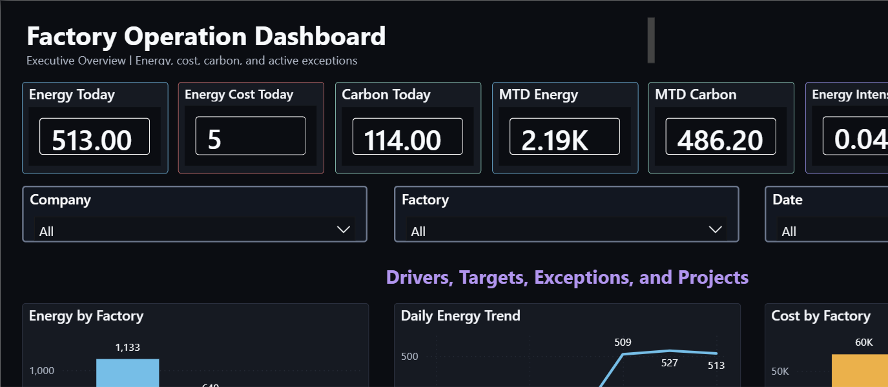

# Power BI Service Factory Operation Dashboard

A multi-company factory operations dashboard MVP built with BigQuery and Power BI. The first implemented business pillar is Sustainability / Energy & Environment, covering energy usage, cost, carbon impact, targets, equipment usage, alerts, and energy-saving projects.



[Open the exported dashboard PDF](assets/exports/Factory_Operation_Dashboard_MVP.pdf)

## Business Purpose

This project demonstrates how a single Power BI report can serve multiple factory companies while keeping each company's data separated through row-level security.

The dashboard is designed for factory leaders who need to answer:

- Are energy, carbon, cost, and operational exceptions healthy today?
- Which factories or equipment categories are driving performance?
- Where are alerts, target gaps, and energy-saving projects concentrated?
- Can one reusable dashboard support multiple companies safely?

## Dashboard Pages

The Power BI report currently includes six pages:

1. Executive Overview
2. Energy Performance Deep Dive
3. Equipment and Cost Breakdown
4. Alerts and Energy Projects
5. RLS and Admin Validation
6. Energy Story Lab

Pages 1-4 use a consistent operating-dashboard layout. Pages 5-6 use an alternate storytelling style to avoid a repetitive report experience.

## Technical Overview

The MVP architecture is:

```text
Mock factory data
  -> BigQuery raw/security/mart datasets
  -> Power BI PBIP semantic model
  -> Power BI report pages
  -> Power BI Service publishing
```

Key technical choices:

- BigQuery mart views are the Power BI-ready data layer.
- Power BI uses Import Mode for lower query cost and faster dashboard interaction.
- Row-level security is modeled with `user_company_security`.
- The report is stored as a PBIP project so model and report artifacts can be versioned in Git.
- The dashboard uses a dark theme designed for readability during repeated operational review.

## Repository Structure

- `bigquery/` - SQL scripts and load commands for raw, security, and mart datasets.
- `mock_data/` - sample multi-company factory energy and operations data.
- `powerbi/` - Power BI PBIP project, semantic model, report definition, and theme.
- `assets/screenshots/` - dashboard screenshots used in this README.

## Main Files

- [Power BI project](powerbi/Factory_Operation_Dashboard_MVP.pbip)
- [BigQuery setup](README_bigquery_setup.md)
- [Energy sustainability data scope](README_energy_sustainability.md)
- [Architecture decisions](Analytics_SaaS_Architecture_Decisions.md)
- [Progress log and lessons learned](Factory_Operation_Dashboard_Progress_Log.md)

## Notes

This is an MVP/portfolio project using mock data. It is intended to show dashboard design, semantic modeling, warehouse-backed BI structure, and multi-company security patterns rather than production customer data.
